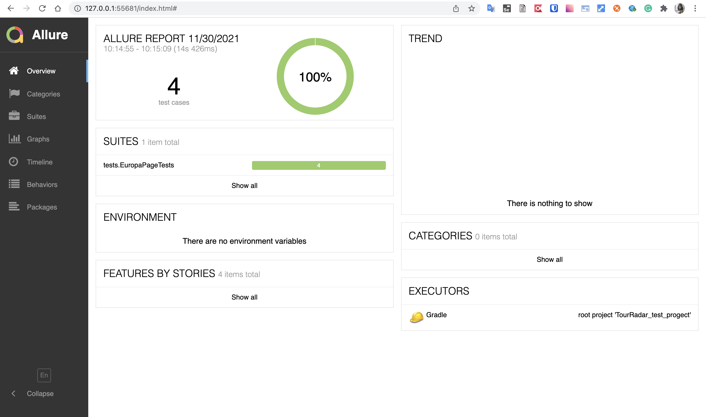
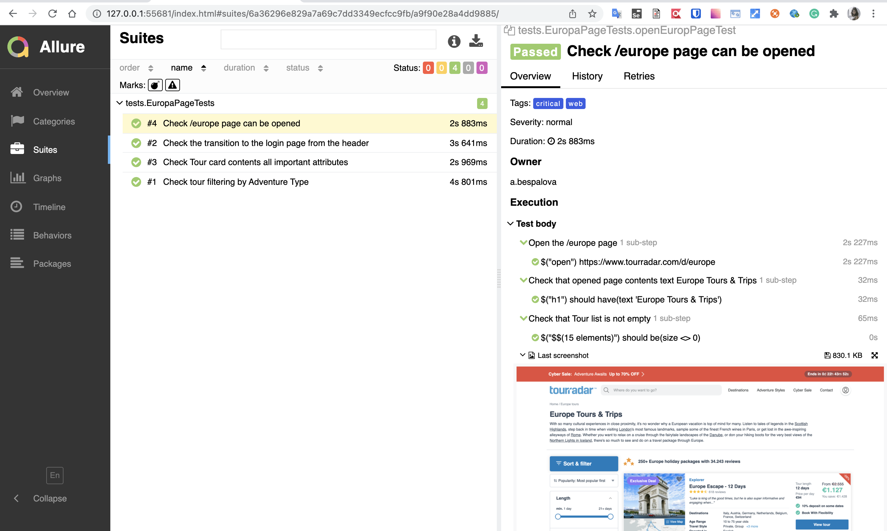
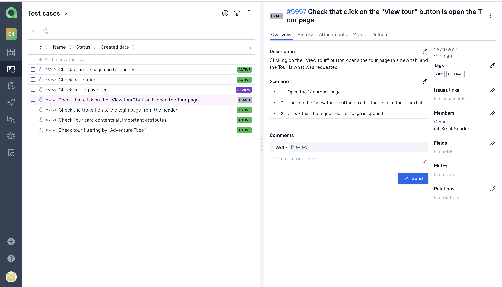

# TourRadar_test_progect
## Technology Stack
**Java, Gradle, Junit5, Selenide, Allure Reports, Allure TestOps**
<br><br>

Run tests local:
```bash
gradle clean test
```

#### *Allure Report is connected to build reports:*
Serve report:
```bash
allure serve build/allure-results
```



<br><br>
#### *Allure TestOps is used as Test Management system:*


